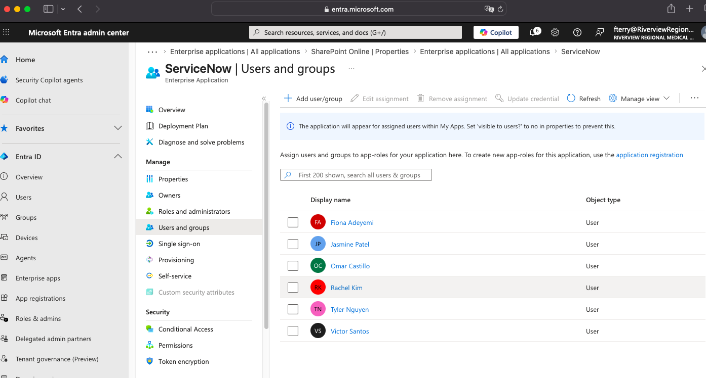
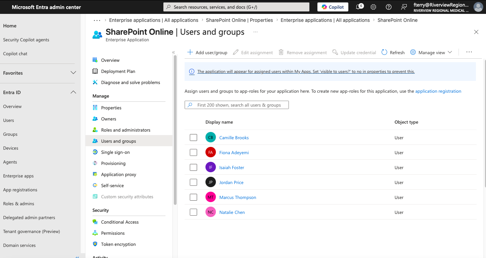
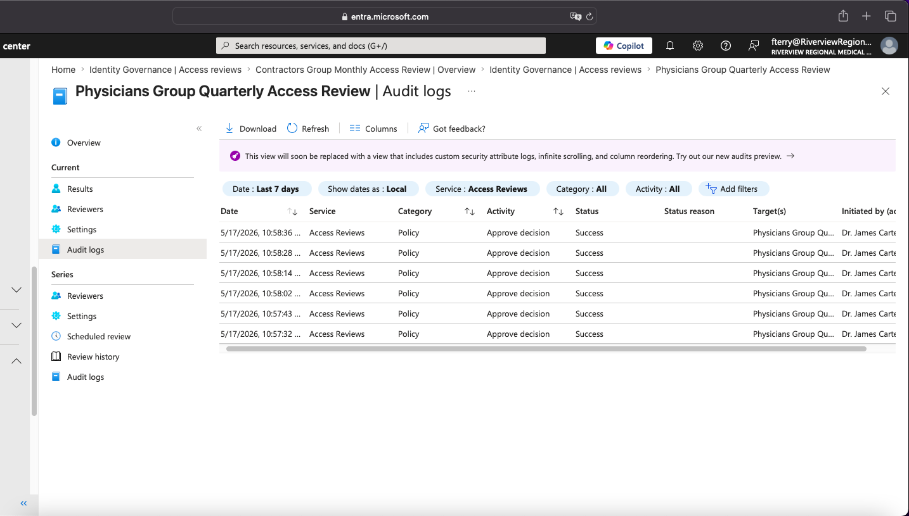
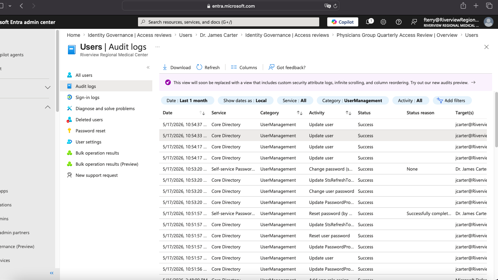

# Microsoft Entra ID: IAM Configuration & Identity Lifecycle Management

**Project Type:** IAM Engineering | Identity Lifecycle Management | Cloud Identity Governance  
**Environment:** Microsoft Entra ID (Free Tenant + P2 Trial), PowerShell, Microsoft Graph SDK  
**Simulated Org:** Riverview Regional Medical Center (fictional healthcare environment)

---

## Overview

An end-to-end IAM project covering the full Joiner-Mover-Leaver (JML) lifecycle in Microsoft Entra ID. Built in a simulated healthcare environment with users provisioned across Clinical, IT, Operations, and Contractor departments. Each phase covers a distinct layer of identity governance — from manual provisioning through automated offboarding — with NIST SP 800-53 framework mappings applied throughout.

---

## Project Structure

| Phase | Focus | Method |
|---|---|---|
| Day 1 — Part A | Manual user and group provisioning | Entra admin portal |
| Day 1 — Part B | Automated bulk provisioning + Admin Units | PowerShell + Microsoft Graph SDK |
| Day 2 | Privileged Identity Management (PIM) | Entra ID P2 |
| Day 3 | Enterprise app assignments (PowerShell automation) | PowerShell + Microsoft Graph SDK |
| Day 6 | Zero Trust Conditional Access enforcement (5 policies) | PowerShell + Entra ID P2 |
| Day 4 | Access reviews (Identity Governance) | Entra Identity Governance |
| Day 5 | Contractor offboarding automation | PowerShell + CSV |

---

## Day 1 — User Provisioning & Tenant Baseline

### Part A — Manual Provisioning

Manual provisioning of the Riverview Regional Medical Center tenant. Security groups and users were created individually through the Entra admin portal to establish the identity baseline before automating at scale.

---

**Step 1 — Security groups created**

Five security groups provisioned to support role-based access control: Billing, IT Admins, Nurses, Physicians, and Receptionists. All configured as Security type with Assigned membership — no dynamic rules at this stage, consistent with a least-privilege baseline before app assignments are configured in later phases.

**NIST Mapping:** AC-2 (Account Management), AC-6 (Least Privilege)

---

**Step 2 — Dr. James Carter created (Attending Physician, Clinical)**

Manual user creation via Entra portal. UPN, display name, job title (Attending Physician), and department (Clinical) set at provisioning time. Correct attribute population at the joiner stage is what makes group-based access assignments and access reviews accurate downstream.

**NIST Mapping:** AC-2 (Account Management), IA-12 (Identity Proofing)

---

**Step 3 — Dr. Lisa Park created (Attending Physician, Clinical)**

Second physician provisioned with matching role attributes. Consistent attribute structure across Clinical department users validates the provisioning standard established in Step 2.

**NIST Mapping:** AC-2 (Account Management)

---

**Step 4 — Maria Lopez created (Registered Nurse, Clinical)**

Registered Nurse provisioned in the Clinical department. Role-appropriate job title set at creation to support downstream RBAC group assignment to the Nurses group. Correct department tagging is critical in healthcare environments for HIPAA-aligned access scoping.

**NIST Mapping:** AC-2 (Account Management), AC-3 (Access Enforcement)

---

**Step 5 — All Riverview users confirmed in portal**

Full user list confirmed: Alex Rivera, Dr. James Carter, Fabella Terry (admin), Maria Lopez, Sarah Kim, and Tom Brown. All provisioned as Member type with @RiverviewRegionalMedicalCen UPNs. This view validates consistent naming convention and account structure across all manually created users.

**NIST Mapping:** AC-2 (Account Management)

---

**Step 6 — Password protection configured**

Custom password protection configured at the tenant level with a banned password list targeting role-referencing and org-specific weak credentials: Riverview1, Hospital1, Password1, Welcome1, Nurse2024, Doctor2024, Admin2024. Smart lockout set to threshold of 5 attempts, 30-second lockout duration.

**Architectural note:** Unlike on-premises Active Directory where Fine-Grained Password Policies (FGPP) can be scoped per group, Entra ID applies one password policy at the tenant level — there is no per-group scoping capability. This is a critical architectural consideration for hybrid environments and was documented as a key finding.

Password Protection for Windows Server Active Directory set to **Audit mode** — best practice before moving to Enforced in production.

**NIST Mapping:** IA-5 (Authenticator Management), AC-7 (Unsuccessful Login Attempts)

---

**Step 7 — Alex Rivera policy reviewed**

User-level policy review for Alex Rivera confirming applied policies align with role assignment.

---

**Step 8 — Granting policy documented**

Policy grant configuration captured as part of the Day 1 environment baseline.

---

**Step 9 — Location condition for A. Rivera**

Location-based conditional access condition documented for Alex Rivera as part of the Day 1 baseline review.

---

**Step 10 — Sign-in risk for A. Rivera**

Sign-in risk policy settings reviewed for Alex Rivera as part of the identity protection baseline established on Day 1.

---

**Step 11 — Audit logs: Day 1 activity captured**

Audit logs confirming all Day 1 manual provisioning and configuration activity is logged with Success status.

**NIST Mapping:** IA-5 (Authenticator Management), AC-7 (Unsuccessful Login Attempts)

---

### Part B — Automated Provisioning (PowerShell + Microsoft Graph SDK)

After validating the environment manually, bulk provisioning was automated using a CSV-driven PowerShell script via the Microsoft Graph SDK. Administrative Units were created first to enforce department-scoped admin permissions as a least privilege control before any users were added.

---

**Step 1 — Administrative Units created**

Four AUs confirmed in Entra: RVR-Clinical-AU, RVR-IT-AU, RVR-Operations-AU, RVR-Contractors-AU. Each scopes admin permissions to its department only. No tenant-wide access granted to department admins.

**NIST Mapping:** AC-6 (Least Privilege)

---

**Step 2 — Group owner assigned: Dr. James Carter owns Physicians group**

Business-driven access governance in place from Day 1. The Physicians group owner is Dr. James Carter, not IT. Access decisions for this group are owned by the clinical business lead — this is the foundation for business-owner-driven access reviews in Day 4.

**NIST Mapping:** AC-2 (Account Management), AC-6 (Least Privilege)

---

**Step 3 — Provisioning script executed: 25/25 users created, 0 failed**

Script output confirms 25 users in CSV, 25 successfully created, 0 failed. First 5 users verified live in Entra via Graph API before script exits.

**NIST Mapping:** AC-2 (Account Management), CM-2 (Baseline Configuration)

---

**Step 4 — Users confirmed in Entra ID portal**

Split view: terminal output on left, Entra admin center on right showing all provisioned users live in the tenant.

---

**Step 5 — Audit logs: all Add user events show Success**

Audit logs filtered by Category: UserManagement confirm every provisioning event logged as Success. This is the audit evidence trail for AC-2 compliance.

---

**Step 6 — Audit log detail: initiated by Microsoft Graph Command Line Tools**

Drill-down confirms Activity Type "Add user", Status "success", initiated by Microsoft Graph Command Line Tools. Proves the provisioning was automated via script, not manual portal clicks.

---

**Step 7 — Sign-in baseline: no failures**

Sign-in logs filtered by Status: Failure return "No sign-ins found." Clean baseline with zero unauthorized access attempts at provisioning time.

**NIST Mapping:** AC-2 (Account Management), IA-12 (Identity Proofing), AC-3 (Access Enforcement)

---

## Day 2 — Privileged Identity Management (PIM)

Configured Microsoft Entra PIM to enforce just-in-time (JIT) access for six privileged directory roles. No privileged role is permanently assigned. All activations require MFA and a written business justification, and expire after 1 hour.

**Roles configured for JIT access:** Global Admin, Security Admin, User Admin, Compliance Admin, Privileged Role Admin, Cloud App Admin

**Why this matters:** Standing admin access is one of the most common attack vectors in enterprise environments. A compromised account with permanent Global Admin is a full tenant takeover. PIM eliminates standing access — if an account is compromised, there are no persistent privileges to abuse.

---

**Step 1 — Role settings configured: MFA and justification required on every activation**

Edit role setting for User Administrator confirms Azure MFA is required and justification is required on activation. This is the governance control that prevents standing privileged access — no one holds this role permanently.

**NIST Mapping:** AC-6 (Least Privilege), IA-2 (Identification and Authentication)

---

**Step 2 — PIM Eligible assignments confirmed**

All eligible assignments confirmed live in PIM: Fiona Adeyemi (Compliance Admin), Victor Santos (Network Admin), Omar Castillo (Security Reader), Jasmine Patel (User Admin). Eligible means they must request and activate — they do not hold the role right now.

---

**Step 3 — Time-limited active assignment: Tyler Nguyen, User Administrator, expires 6/14**

Activity details confirm Tyler Nguyen's User Administrator role is Active, assigned 5/15/2026 with a hard expiry of 6/14/2026. Time-bound activation is what separates PIM governance from a standing privileged assignment.

---

**Step 4 — Microsoft Security alerts fired for every PIM assignment**

Microsoft Security sent individual alert emails for each PIM assignment. Every privileged role change generates a notification so no assignment goes undetected — this is real-world security monitoring behavior.

---

**Step 5 — Audit log: all role management events logged as Success**

Audit logs filtered by Category: RoleManagement show every PIM eligible and active assignment logged with Success status.

**NIST Mapping:** AC-6 (Least Privilege), IA-5 (Authenticator Management), AU-2 (Event Logging)

---

## Day 3 — Enterprise App Assignments (PowerShell Automation)

Added enterprise applications to the Entra ID tenant and configured user-to-app assignments using a CSV-driven PowerShell script via Microsoft Graph SDK. App assignments were scoped by job function — clinical staff received Epic EHR, security team received Microsoft Defender, IT and admin staff received ServiceNow, HR and Billing received Workday, and all employees received Microsoft Teams. Contractors received minimum access only. Every assignment is justified, role-based, and traceable in audit logs.

**Apps deployed:**
- Epic EHR — Clinical staff only
- Microsoft Teams — All employees
- Microsoft Defender — Security/IT team only
- ServiceNow — IT, Security, and Admin roles
- SharePoint Online — Operations and Admin
- Workday — HR and Billing only

---

**Step 1 — Script executed: 54/54 assignments successful, 0 failed, Diana Reyes verified**

Terminal output confirms DAY 3 FIX — RIVERVIEW REGIONAL: Total 54, Success 54, Failed 0, Skipped 0. Post-run verification checks Diana Reyes — Epic EHR and Microsoft Teams confirmed live in Graph as of 5/16/2026 6:47:36 PM. Script ran in PowerShell (pwsh), not bash.

---

**Step 2 — Epic EHR: 12 clinical users assigned**

Epic EHR Users and Groups shows all 12 clinical staff assigned: Alexis Turner, Andre Morales, Brianna Ellison, Carlos Vega, Diana Reyes, James Okafor, Keisha Washington, Lena Hoffman, Malik Harris, Priya Nair, Simone Dupont, Tasha Griffin. Clinical access is scoped to clinical department only — no admin or contractor users appear here.

---

**Step 3 — Microsoft Teams: all users assigned**

Microsoft Teams Users and Groups confirms broad org-wide assignment — all employees across departments are present. This is the baseline collaboration tool that every Riverview user requires regardless of role.

---

**Step 4 — Microsoft Defender: security team only**

Microsoft Defender scoped to 3 users: Brandon Yates, Jasmine Patel, Omar Castillo — all IT/Security roles. No clinical or admin users assigned. This is least privilege enforced at the app layer — security tooling is only accessible to security personnel.

---

**Step 5 — ServiceNow: IT and admin staff only**

ServiceNow scoped to Fiona Adeyemi, Jasmine Patel, Omar Castillo, Rachel Kim, Tyler Nguyen, Victor Santos — IT, Security, and Admin roles only. Clinical and Billing staff do not have ServiceNow access.

---

**Step 6 — SharePoint Online: operations and admin users**

SharePoint Online assigned to Camille Brooks, Fiona Adeyemi, Isaiah Foster, Jordan Price, Marcus Thompson, Natalie Chen — Operations and Admin staff who need document collaboration access.

---

**Step 7 — Workday: HR and Billing only**

Workday scoped to Camille Brooks and Devon Lawson — HR and Billing roles exclusively. No other departments have access to HR/payroll tooling. This is the tightest app scope in the project — Workday contains compensation and HR data, so access is limited to the two users who need it by job function.

**NIST Mapping:** AC-3 (Access Enforcement), AC-6 (Least Privilege), CM-7 (Least Functionality)

---

## Day 4 — Access Reviews (Identity Governance)

Created and launched access reviews in Entra ID Identity Governance across 5 groups: Contractors (monthly), Security Team, IT Admins, Nurses, and Physicians (all quarterly). Reviews were configured with selected reviewers — not self-review — so business owners make access decisions, not IT. The Physicians Group Quarterly Access Review was run end-to-end with Dr. James Carter as reviewer, with documented justification for every decision.

**Why this matters:** Access reviews are how an organization proves it enforces least privilege over time, not just at provisioning. A user correctly added on Day 1 can become over-permissioned by Day 90 due to a role change or departure. Quarterly reviews close that gap and generate the audit evidence that satisfies AC-2(j) and SOC 2 CC6.3.

---

**Step 1 — 6 access reviews created and confirmed Active**

Identity Governance | Access reviews shows 6 reviews all Active, created 5/17/2026: Contractors Group Monthly Access Review, Security Team Group Quarterly Access Review, IT Admins Group Quarterly Access Review, Nurses Group Quarterly Access Review, Physicians Group Quarterly Access Review, and Physicians Test Review. Contractors are reviewed monthly due to higher offboarding risk — all others run quarterly.

---

**Step 2 — Microsoft Security email triggered: review Contractors group by June 16**

Microsoft Security sent an automated review notification to Fabella Terry: "Action required: Review access to the Contractors group by June 16, 2026." Confirms the access review workflow fired correctly — reviewers receive real email notifications, not just portal alerts.

---

**Step 3 — Before state: Physicians Group — 6 not reviewed, 0 approved**

Physicians Group Quarterly Access Review overview shows starting state: 6 users pending review, 0 approved, 0 denied. Configured as quarterly recurrence with no end date, scope: Everyone, reviewer: Selected users (Dr. James Carter).

---

**Step 4 — Dr. James Carter reviewing via My Access portal**

Dr. James Carter logged into myaccess.microsoft.com in a private window as group owner. Dr. Lisa Park is selected with the decision panel showing: Approved by Dr. James Carter, 5/17/2026 10:58 AM EDT. Documented reason: "Member verified as active credentialed physician. Access appropriate for role." All 6 Physicians group members — Diana Reyes, Dr. James Carter, Dr. Lisa Park, James Okafor, Marcus Thompson, Priya Nair — reviewed and Approved with justification.

---

**Step 5 — After state: Physicians Group — 6 approved, 0 not reviewed**

Physicians Group Quarterly Access Review overview confirms completed state: Not reviewed: 0, Approved: 6, Denied: 0. Every member confirmed as legitimate by the business owner.

---

**Step 6 — Access review audit log: 6 Approve decision events, all Success**

Audit log filtered to last 7 days shows 6 Approve decision events, Service: Access Reviews, Category: Policy, all Success, all initiated by Dr. James Carter on 5/17/2026 between 10:57 and 10:58 AM. Six decisions, six audit records — no gaps.

---

**Step 7 — Dr. Carter user audit log: all reviewer activity captured**

Users | Audit logs filtered to Dr. James Carter shows UserManagement events from the review session on 5/17/2026: Update user, Change password, Reset password — all Success. Full activity trail for the reviewer account during the review window.

**NIST Mapping:** AC-2 (Account Management), AC-2(j) (Account Review), IA-4 (Identifier Management), AU-2 (Event Logging), SOC 2 CC6.3

---

## Day 5 — Contractor Offboarding Automation

Executed a multi-user offboarding workflow for 2 contractors using a CSV-driven PowerShell script. The script handled a real-world edge case: one contractor was already in an offboarded state. Instead of failing, it logged the condition and continued — that error handling is what separates a production script from a lab script.

**Offboarding actions per user:** App assignment removal, directory role check, session and token revocation, account disable, group removal, and Entra deletion to Deleted Users bin.

---

**Step 1 — Brandon Yates: 6-step offboarding executed**

Individual offboarding script for Brandon Yates shows each step sequentially: app assignments removed (Teams, Defender), directory roles checked, all sessions and tokens invalidated, account disabled, removed from Security-Team and Contractors groups. Six discrete steps, all logged.

---

**Step 2 — Multi-user script: Brandon SKIPPED, Lena OFFBOARDED SUCCESSFULLY**

The CSV-driven multi-user script processes both contractors. Brandon Yates returns NOT FOUND — already offboarded — so the script logs it and continues without failing. Lena Hoffman is fully offboarded through all 6 steps including deletion to Deleted Users bin. Final summary: 2 processed, 1 skipped, 1 complete.

---

**Step 3 — Contractors group: 0 members confirmed**

Contractors group overview confirms Total direct members: 0. Both contractors removed. The group still exists for future contractor provisioning — the group is not deleted, just emptied. This is correct IAM hygiene.

---

**Step 4 — Contractors group audit log: Remove member events logged as Success**

Contractors group audit log confirms two Remove member from group events on 5/18/2026, both showing Success. The full JML lifecycle is now captured in the audit trail: Add member (Day 1) → Access review (Day 4) → Remove member (Day 5).

**NIST Mapping:** AC-2(3) (Disable Inactive Accounts), PS-4 (Personnel Termination), IA-4 (Identifier Management)

---

## Day 6 — Zero Trust Conditional Access Enforcement

Disabled security defaults and deployed 5 Conditional Access policies via PowerShell and Microsoft Graph to enforce Zero Trust across the Riverview Regional tenant. All policies deployed to Report-only mode first for sign-in impact assessment before any enforcement goes live. MFA enforcement was confirmed by live testing with a provisioned user account.

**The 5 policies automated:**
1. Require MFA for all users on all cloud apps
2. Block access for high sign-in risk
3. Require compliant or hybrid-joined device
4. Block access from non-approved locations
5. Enforce session controls (sign-in frequency, persistent browser)

**Why Report-only first:** Enforcing Conditional Access without impact assessment in a live environment can break access for legitimate users. Report-only lets you see exactly who would be affected before flipping policies to Enabled. That's the change management discipline that separates a lab from production thinking.

---

**Step 1 — Security defaults disabled: deliberate governance decision documented**

Security defaults set to Disabled with reason "My organization is planning to use Conditional Access." This is a deliberate, documented decision — disabling security defaults without replacement CA policies would leave the tenant exposed. The reason field is the paper trail.

---

**Step 2 — All 5 policies deployed via PowerShell: 5 created, 0 failed**

Script output confirms all 5 policies created in Report-only mode. Each policy logged with its deployment state. Zero failures.

---

**Step 3 — CA Overview: 6 Report-only policies confirmed in portal**

Conditional Access overview shows 0 Enabled, 6 Report-only, 0 Off. All policies in assessment mode — safe deployment pattern before enforcement. Report-only captures sign-in impact data without blocking anyone.

---

**Step 4 — Admin lockout prevention: Fabella Terry excluded from all policies**

RVR-CA-001 Exclude tab confirms Fabella Terry explicitly excluded from the policy. The same exclusion was applied to all 5 policies. Without a break-glass exclusion, the admin account can be permanently locked out of the tenant — this is standard production safeguard.

---

**Step 5 — MFA enforcement confirmed: Diana Reyes prompted on login**

Live test with Diana Reyes's account confirms MFA policy is firing. Microsoft Authenticator install prompt appears on login — expected behavior when a CA policy triggers for a user with no MFA method registered yet.

---

**Step 6 — Audit log: Diana Reyes MFA registration events logged as Success**

Audit log filtered to Diana Reyes shows the full MFA registration chain: User started security registration → User registered authentication method → User registered all required security info. All Success. This is the complete evidence trail from policy deployment to user enforcement to audit record.

**NIST Mapping:** AC-17 (Remote Access), IA-2 (Identification and Authentication), IA-5 (Authenticator Management), SI-4 (System Monitoring)

---

## Key Findings

| Finding | Detail |
|---|---|
| Password policy scope | Entra ID applies one policy tenant-wide; on-prem AD supports per-group FGPP — critical hybrid architecture consideration |
| Custom banned passwords | Role/org-referencing terms blocked to prevent predictable healthcare-context credentials |
| Password protection mode | Set to Audit — best practice before moving to Enforced in production |
| PIM JIT access | Eliminates standing privileges for 6 sensitive roles; MFA + justification required on every activation |
| Security defaults | Disabled with documented reason before CA deployment — not accidental |
| CA Report-only first | All 5 Zero Trust policies deployed to Report-only for impact assessment before enforcement |
| Admin break-glass exclusion | Admin account explicitly excluded from all CA policies — prevents tenant lockout |
| MFA enforcement confirmed | Live test with Diana Reyes confirms policies fire correctly before enforcement mode |
| Access reviews | Group Owner as reviewer, not IT self-review; denial justifications documented |
| Offboarding error handling | Multi-user script handles pre-offboarded accounts gracefully — logs and continues without failure |
| Full JML audit trail | Add user (Day 1) → PIM assignment (Day 2) → Access review (Day 4) → CA enforcement (Day 6) → Remove member (Day 5) — all captured in Entra audit logs |

---

## Frameworks Referenced

- NIST SP 800-53 AC-2 (Account Management)
- NIST SP 800-53 AC-2(j) (Account Review)
- NIST SP 800-53 AC-2(3) (Disable Inactive Accounts)
- NIST SP 800-53 AC-3 (Access Enforcement)
- NIST SP 800-53 AC-6 (Least Privilege)
- NIST SP 800-53 AC-7 (Unsuccessful Login Attempts)
- NIST SP 800-53 AC-17 (Remote Access)
- NIST SP 800-53 IA-2 (Identification and Authentication)
- NIST SP 800-53 IA-4 (Identifier Management)
- NIST SP 800-53 IA-5 (Authenticator Management)
- NIST SP 800-53 IA-12 (Identity Proofing)
- NIST SP 800-53 AU-2 (Event Logging)
- NIST SP 800-53 PS-4 (Personnel Termination)
- NIST SP 800-53 CM-2 (Baseline Configuration)
- SOC 2 CC6.3 (Access Review)
- Microsoft Zero Trust and Conditional Access best practices

---

## Skills Demonstrated

`Microsoft Entra ID` `RBAC` `User Provisioning` `Group Management` `Security Groups` `Administrative Units` `Password Policy` `Custom Banned Passwords` `Smart Lockout` `PIM` `Just-In-Time Access` `Conditional Access` `MFA` `Sign-in Risk` `Enterprise App Assignments` `Identity Governance` `Access Reviews` `JML Framework` `PowerShell Automation` `Microsoft Graph SDK` `CSV-Driven Provisioning` `Offboarding Automation` `NIST 800-53` `SOC 2` `Hybrid IAM Architecture` `Entra ID P2` `Audit Logging` `Healthcare IAM`
