# Microsoft Entra ID: Identity Lifecycle Management Governance Program

**Environment:** Microsoft Entra ID | PowerShell 7.6 | Microsoft Graph SDK  
**Simulated Organization:** Riverview Regional Medical Center  
**Scope:** 25 users | 6 enterprise applications | 5 Conditional Access policies | Full JML lifecycle  
**Framework Mapping:** NIST SP 800-53 Rev. 5  

---

## Overview

This project demonstrates end-to-end identity governance in a live Microsoft Entra ID environment built for a simulated healthcare enterprise. It covers the full identity lifecycle from provisioning through offboarding, with Privileged Identity Management, enterprise application governance, formal access reviews, and Zero Trust Conditional Access enforcement.

Every phase was automated with PowerShell and Microsoft Graph where appropriate and documented with audit-style evidence. The work reflects how IAM governance operates in regulated industries where identity controls directly impact compliance, data security, and operational continuity.

---

## Business Problem

Enterprises in regulated industries face a consistent identity governance problem: too many identities, too little process. Accounts get provisioned without owners. Privileged access never gets revoked. Contractors stay active past their end dates. Access reviews are checkbox exercises with no documented evidence.

This project builds the governance infrastructure that solves that problem: automated provisioning, just-in-time privilege, formal access reviews, and Zero Trust enforcement: documented to audit standards.

---

## Environment

| Component | Details |
|---|---|
| Identity Platform | Microsoft Entra ID (Free Developer Tenant) |
| Tenant | RiverviewRegionalMedicalCen.onmicrosoft.com |
| User Population | 25 users across Clinical, Operations, IT, Cybersecurity, Contractors |
| Applications | Epic EHR, Workday, ServiceNow, Microsoft Teams, SharePoint Online, Microsoft Defender |
| Automation | PowerShell 7.6.1, Microsoft Graph SDK |

---

## Project Timeline

### Day 1: User Provisioning — Manual and Automated

Provisioned 25 users across 5 workforce segments using both manual portal configuration and a PowerShell automation script with the Microsoft Graph SDK. Administrative Units were created first to enforce department-scoped admin permissions as a least privilege control before any users were added.

**What was built:**
- 4 Administrative Units (Clinical, IT, Operations, Contractors)
- Manual user creation and group assignment via Entra portal
- 25 users provisioned via bulk CSV-driven automation script
- Role-based group assignments for all users
- Audit log review confirming all provisioning events

---

#### Part A — Manual Provisioning (Portal)

Manual provisioning was completed first to validate the environment and understand the user object structure before automating at scale. This step documents the baseline configuration and group owner assignments.

**Step 1 — Administrative Units created before provisioning**

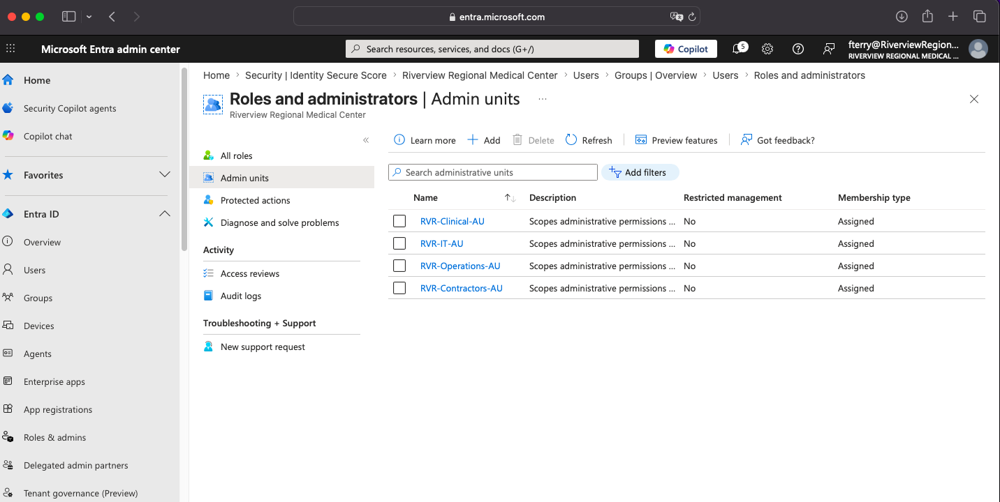

All 4 AUs confirmed in Entra: RVR-Clinical-AU, RVR-IT-AU, RVR-Operations-AU, RVR-Contractors-AU. Each scopes admin permissions to its department only — no tenant-wide access granted.

**Step 2 — Group owner assigned: Dr. James Carter owns Physicians group**

Business-driven access governance in place from Day 1. The Physicians group owner is Dr. James Carter, not IT. Access decisions for this group are owned by the clinical business lead, not the helpdesk.

**Step 3 — Manual user creation: Dr. James Carter created in portal**

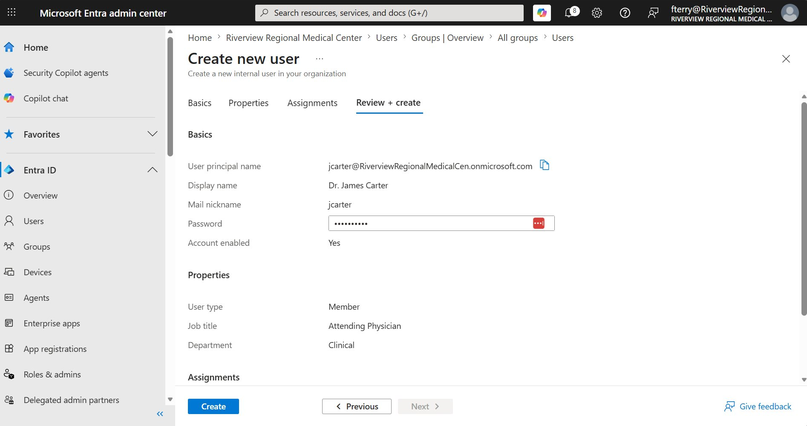

Manual user creation via Entra portal demonstrates the underlying object structure that the automation script replicates at scale. Each field — display name, UPN, department, job title — maps directly to the CSV columns used in the automated provisioning script.

**Step 4 — Role-based security groups created manually**

5 security groups created in Entra: Billing, IT Admins, Nurses, Physicians, Receptionists. Group-based access is the foundation for all downstream controls — app assignments in Day 3 and access reviews in Day 4 are all group-scoped.

**Step 5 — All Riverview users confirmed in portal**

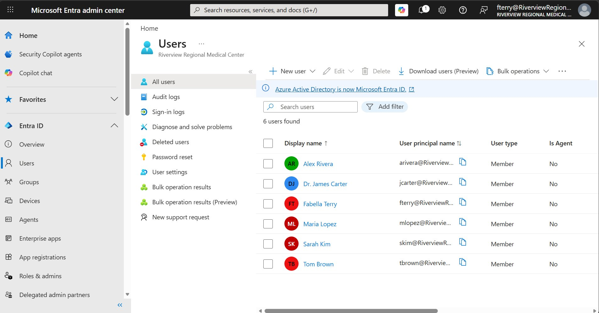

Full user list confirmed in Entra showing all provisioned Riverview Regional Medical Center users. This view validates that both manual and automated provisioning produced consistent, correctly-formatted user objects.

**Step 6 — Dr. James Carter confirmed as member of Physicians group**

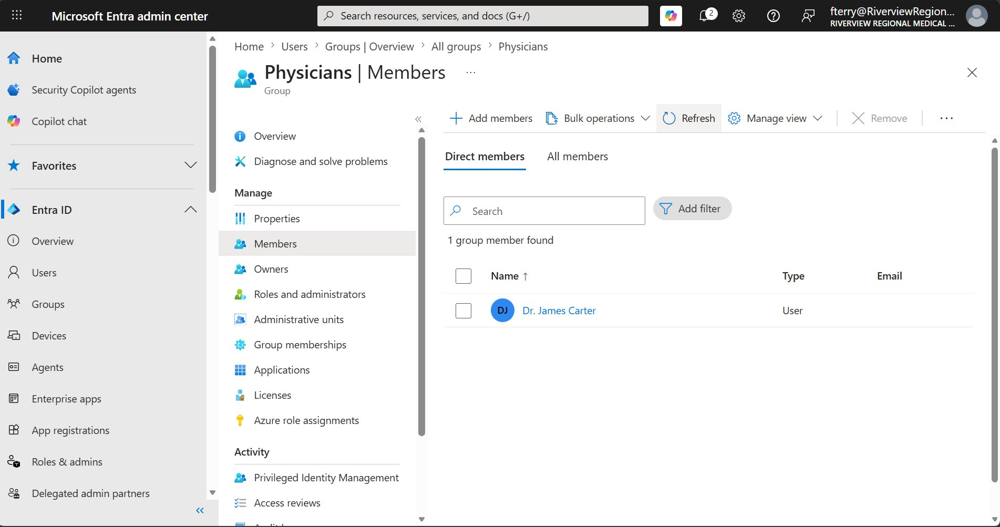

Physicians | Members view confirms Dr. James Carter is the direct member of the Physicians group. This manual group assignment establishes the group owner relationship used in Day 4 access reviews.

**Step 10 — Manual CA policy: Grant control set to Require MFA**

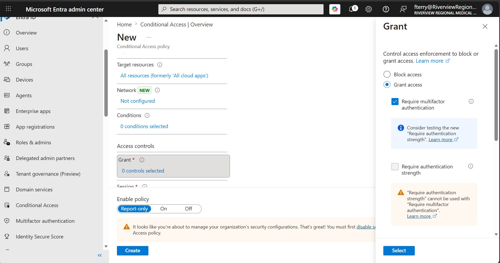

New Conditional Access policy being built manually showing the Grant panel — "Grant access" selected with "Require multifactor authentication" checked. This is the manual build step that validated the MFA grant control before automation.

**Step 11 — Password protection configured: custom banned password list**

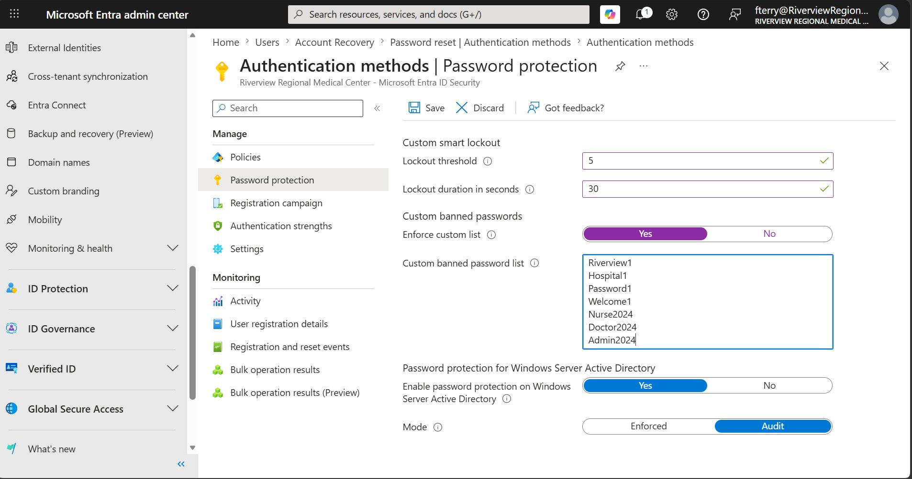

Authentication methods password protection configured with a custom banned password list specific to the healthcare environment: Riverview1, Hospital1, Password1, Welcome1, Nurse2024, Doctor2024, Admin2024. Smart lockout threshold set to 5 attempts, lockout duration 30 seconds. Password protection for Windows Server AD enabled in Audit mode.

**Step 7 — Manual CA policy: Require MFA for IT Admins scoped to Alex Rivera**

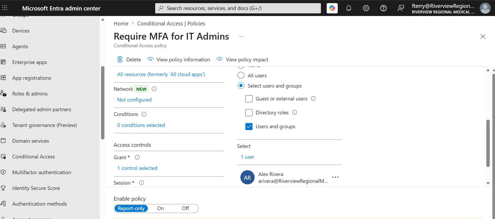

Conditional Access policy "Require MFA for IT Admins" manually configured and scoped to Alex Rivera as a test user. This manual build validated the CA policy structure before the automated 5-policy deployment in Day 6.

**Step 8 — Location condition manually configured**

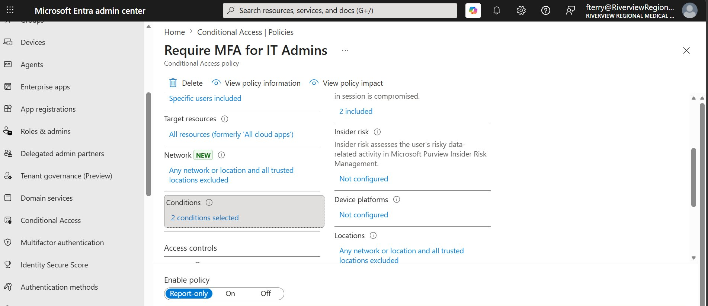

Location condition added to the policy — any network or trusted location excluded. 2 conditions selected total. This manual configuration confirmed how location-based conditions interact with the policy before automation.

**Step 9 — Sign-in risk condition: High and Medium selected**

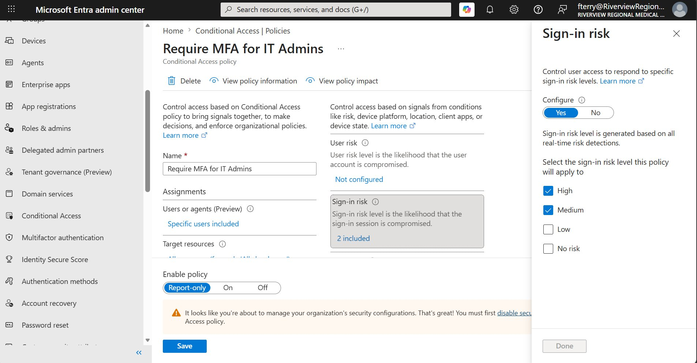

Sign-in risk condition manually set to High and Medium risk levels. This validated the risk-based access control behavior on a single test user before the same logic was deployed tenant-wide in the automated CA policy RVR-CA-004 in Day 6.

**Step 11 — Audit logs: Day 1 activity captured**

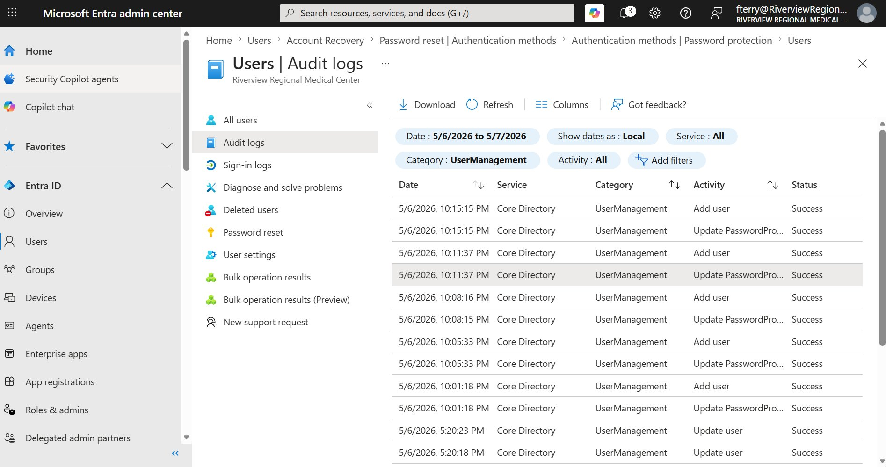

Audit logs confirming all Day 1 manual provisioning and configuration activity is logged with Success status.

---

#### Part B — Automated Provisioning (PowerShell + Microsoft Graph SDK)

After validating the environment manually, bulk provisioning was automated using a CSV-driven PowerShell script via the Microsoft Graph SDK. 25 users provisioned in a single script execution.

**Step 3 — Provisioning script executed: 25/25 users created, 0 failed**

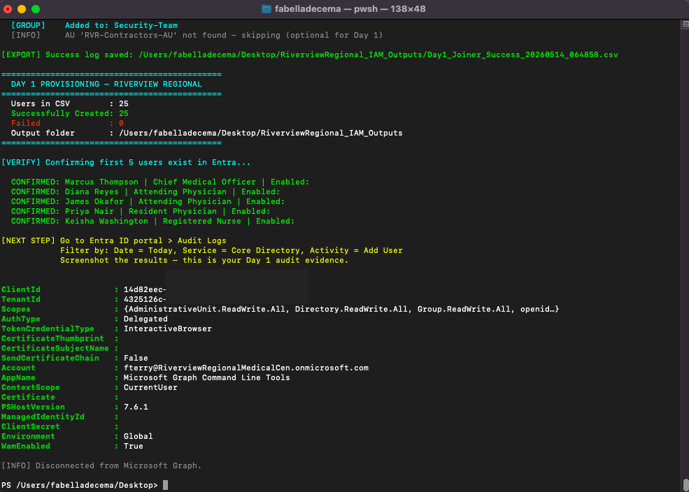

Script output confirms 25 users in CSV, 25 successfully created, 0 failed. First 5 users verified live in Entra via Graph API before script exits.

**Step 4 — Users confirmed in Entra ID portal**

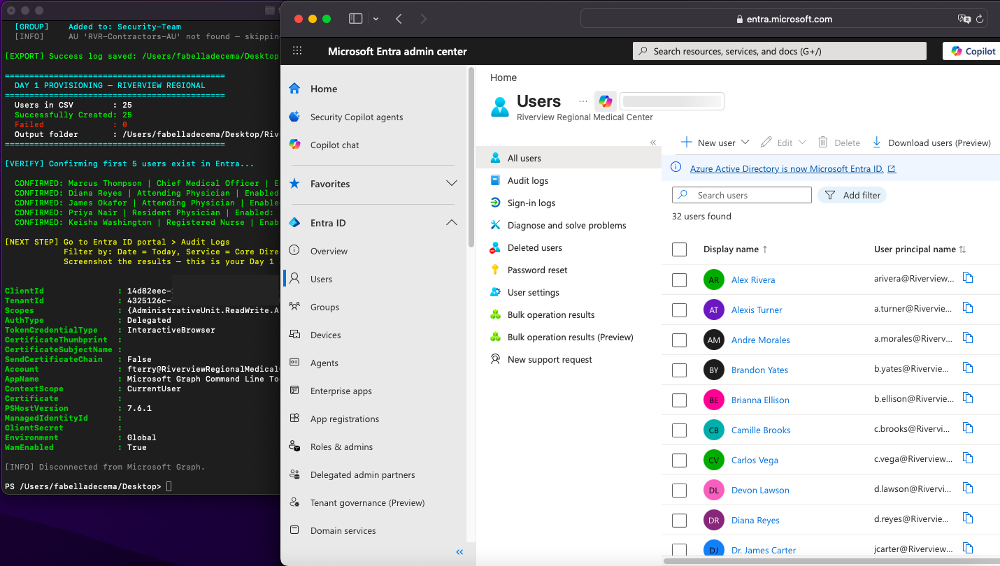

Split view: terminal output on left, Entra admin center on right showing all provisioned users live in the tenant.

**Step 5 — Audit logs reviewed: all Add user events show Success**

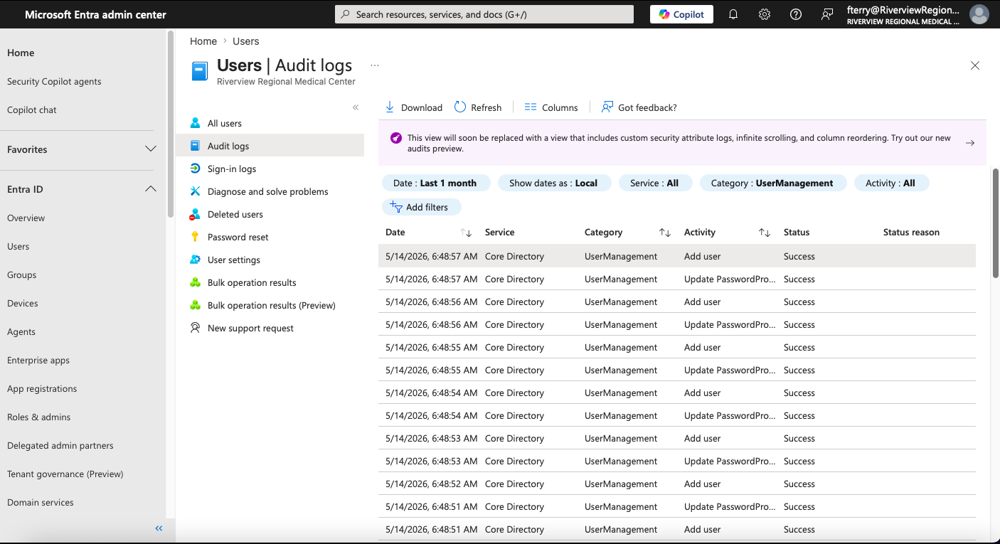

Audit logs filtered by Category: UserManagement confirm every provisioning event logged as Success. This is the audit evidence trail for AC-2 compliance.

**Step 6 — Audit log detail: initiated by Microsoft Graph Command Line Tools**

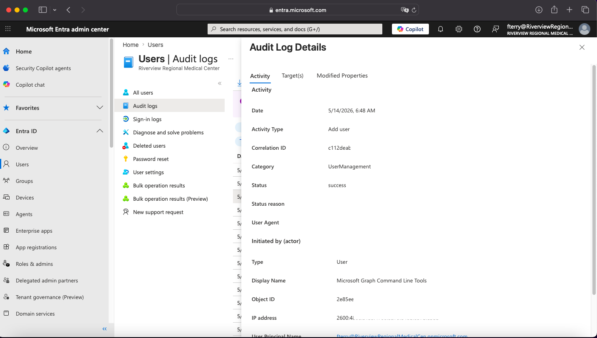

Drill-down confirms Activity Type "Add user", Status "success", initiated by Microsoft Graph Command Line Tools. Proves the provisioning was automated via script, not manual portal clicks.

**Step 7 — Sign-in baseline: no failures**

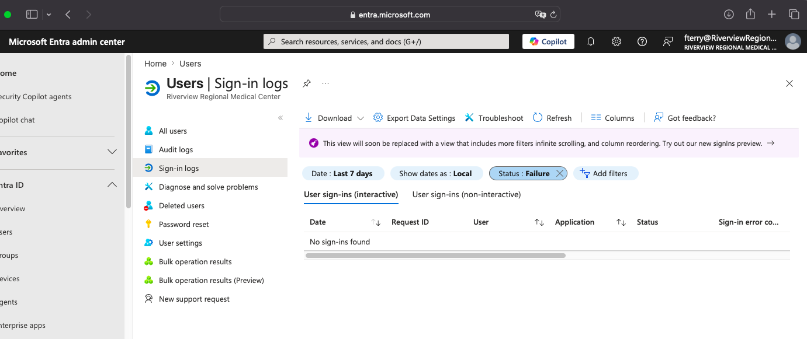

Sign-in logs filtered by Status: Failure return "No sign-ins found." Clean baseline with zero unauthorized access attempts at provisioning time.

**NIST Mapping:** AC-2 (Account Management), IA-12 (Identity Proofing), AC-3 (Access Enforcement)

---

### Day 2: Privileged Identity Management (PIM)

Configured Microsoft Entra PIM to enforce just-in-time access for six privileged directory roles. No privileged role is permanently assigned. All activations require MFA and written business justification and expire after 1 hour.

**What was built:**
- PIM Eligible assignments for Global Admin, Security Admin, User Admin, Compliance Admin, Privileged Role Admin, Cloud App Admin
- Activation policy: MFA required, justification required, 1-hour maximum
- Microsoft Security alert emails reviewed and documented

**Step 1 — Role settings configured: MFA and justification required on every activation**

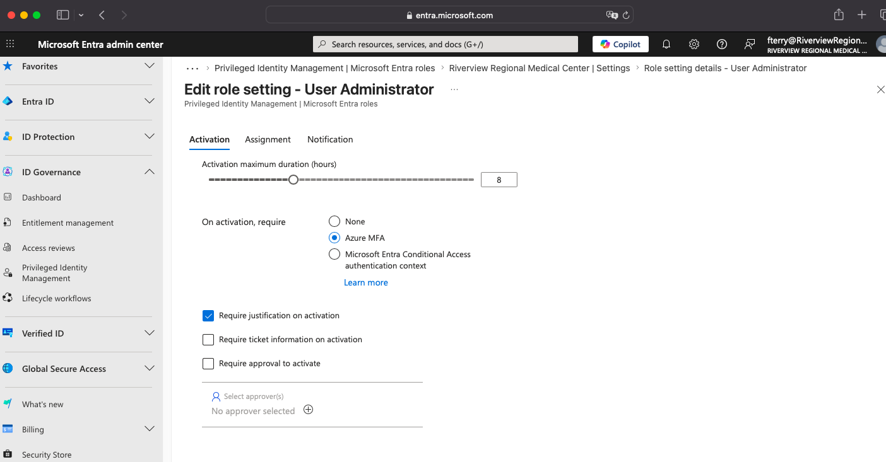

Edit role setting for User Administrator confirms Azure MFA is required and justification is required on activation. This is the governance control that prevents standing privileged access — no one holds this role permanently.

**Step 2 — PIM Eligible assignments confirmed: 4 users across 4 roles**

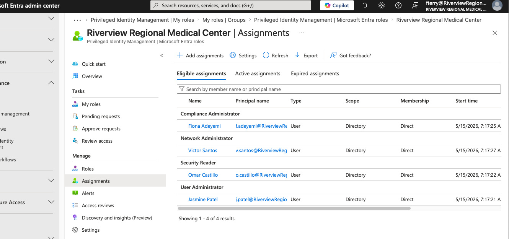

All eligible assignments confirmed live in PIM: Fiona Adeyemi (Compliance Admin), Victor Santos (Network Admin), Omar Castillo (Security Reader), Jasmine Patel (User Admin). Eligible means they must request and activate — they do not have the role right now.

**Step 3 — Time-limited active assignment: Tyler Nguyen, User Administrator, expires 6/14**

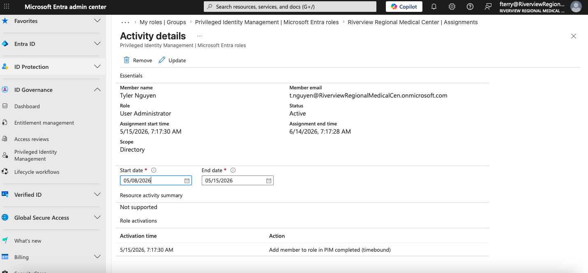

Activity details confirm Tyler Nguyen's User Administrator role is Active, assigned 5/15/2026 with a hard expiry of 6/14/2026. Time-bound activation is what separates PIM governance from a standing privileged assignment.

**Step 4 — Microsoft Security alerts fired for every PIM assignment**

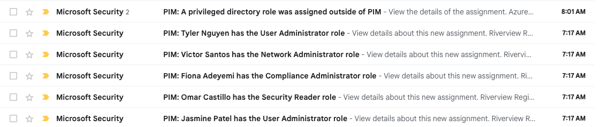

Microsoft Security sent individual alert emails for each PIM assignment. This is real-world security monitoring behavior — every privileged role change generates a notification so no assignment goes undetected.

**Step 5 — Audit log: all role management events logged as Success**

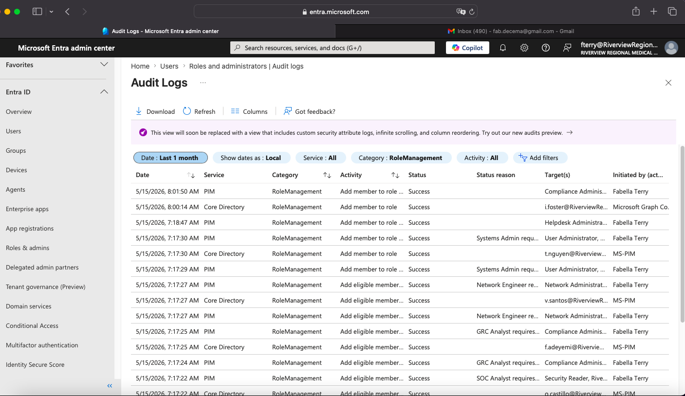

Audit logs filtered by Category: RoleManagement show every PIM eligible and active assignment logged with Success status. This is the audit trail required for AC-6 and AU-2 compliance documentation.

**Step 6 — Real-world troubleshooting: 6/7 success, 1 failure, error handled**

Script summary shows 7 total assignments attempted, 6 successful, 1 failed. The failure was a role name mismatch ("Compliance Reader" does not exist in Entra — the correct role is "Compliance Administrator"). A fix script was run separately and resolved the assignment. This is production-level error handling, not a clean tutorial run.

**NIST Mapping:** AC-6 (Least Privilege), IA-5 (Authenticator Management), AU-2 (Event Logging)

---

### Day 3: Enterprise Application Assignment

Assigned all 25 users to 6 enterprise applications based on role requirements. A fix script first created app roles on non-gallery applications before bulk assignments ran, which is a real production pattern that most tutorials skip.

**What was built:**
- App role creation for Epic EHR, Workday, ServiceNow (custom non-gallery apps)
- Bulk user-to-app assignments via PowerShell
- Assignment validation through user portal and admin center

**Step 1 — Fix script result: 54/54 assignments, 0 failed**

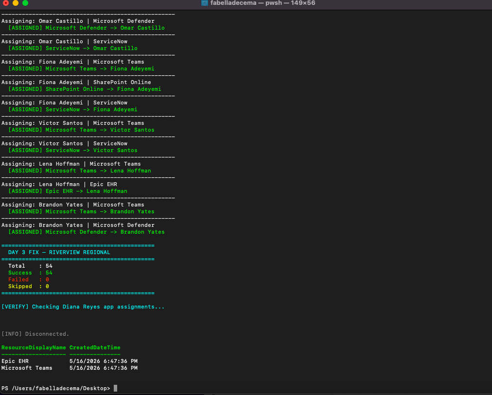

Total 54 assignments across all apps: 54 success, 0 failed, 0 skipped. The fix script first created app roles on non-gallery apps before bulk assignments ran. Without this step, all assignments would have failed silently.

**Step 2 — Microsoft Teams: broad access, all staff assigned**

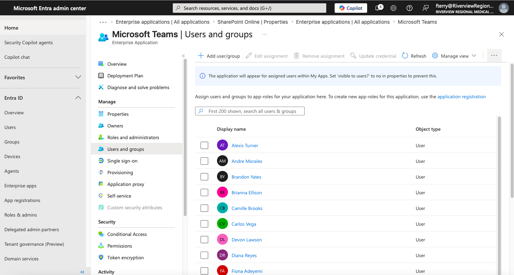

Teams is assigned to all workforce segments — clinical, operations, IT, and contractors. Broad collaboration access reflects the CM-7 principle: provide access to tools required for the role, no more.

**Step 3 — Microsoft Defender: scoped to 3 security users only**

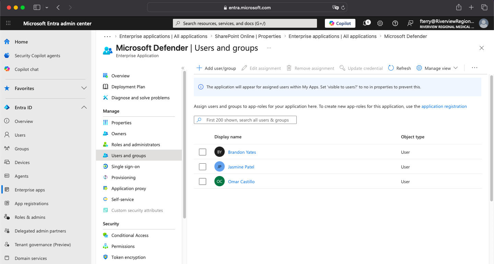

Defender is assigned to Brandon Yates, Jasmine Patel, and Omar Castillo only — the cybersecurity team. Three users out of 25. This is least privilege in practice: security tooling is not visible to clinical or administrative staff.

**Step 4 — Workday: scoped to 2 HR/finance users only**

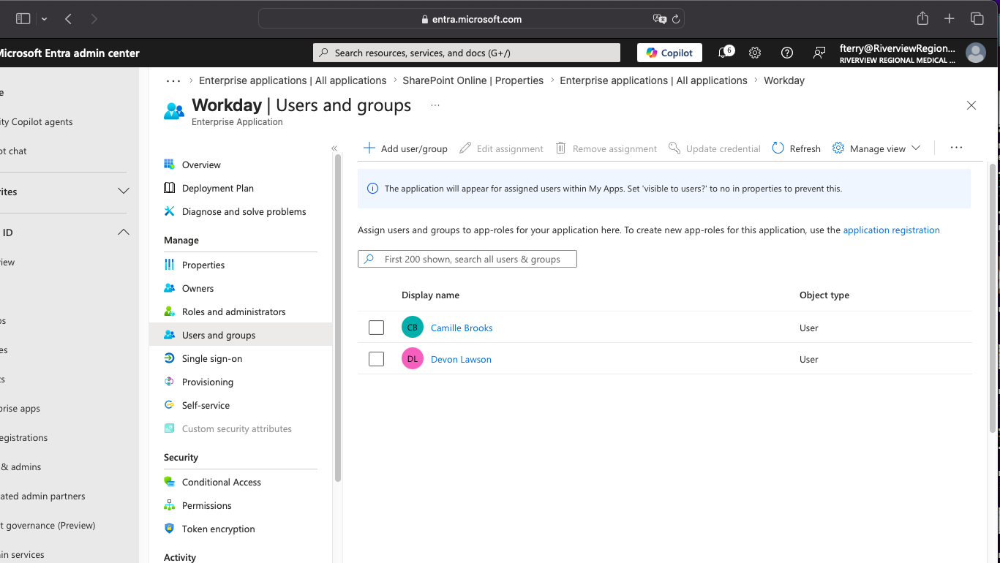

Workday is assigned to Camille Brooks and Devon Lawson only. HR and payroll data is accessible only to the two users whose roles require it. This scoping pattern is what separates governance-driven app assignment from bulk "give everyone everything" provisioning.

**NIST Mapping:** AC-2 (Account Management), AC-3 (Access Enforcement), CM-7 (Least Functionality)

---

### Day 4: Formal Access Review Implementation

Created 5 access reviews targeting clinical, IT, security, and contractor groups. Group owners were designated as reviewers: a governance design choice that puts access decisions with business owners, not just IT. Completed the Physicians Group review as Dr. James Carter through myapps.microsoft.com to generate real audit evidence.

**What was built:**
- 5 access reviews via PowerShell (Physicians, Nursing, IT, Cybersecurity, Contractors)
- Group owner as reviewer: business-driven access governance model
- Access review completed and decisions documented as audit evidence

**Step 1 — All 5 access reviews confirmed Active in Identity Governance**

All 5 reviews live: Contractors Group Monthly, Security Team Quarterly, IT Admins Quarterly, Nurses Quarterly, Physicians Group Quarterly. Created 5/17/2026 via PowerShell, all showing Active status. Monthly cadence for contractors, quarterly for permanent staff — intentional governance design.

**Step 2 — Microsoft Security notification sent to reviewers automatically**

Microsoft Security sent review request emails to all designated group owners. The Contractors group email shows review deadline of June 16, 2026. This is the enforcement mechanism — reviewers cannot claim they were not notified.

**Step 3 — Before: Physicians Group shows 6 users not reviewed**

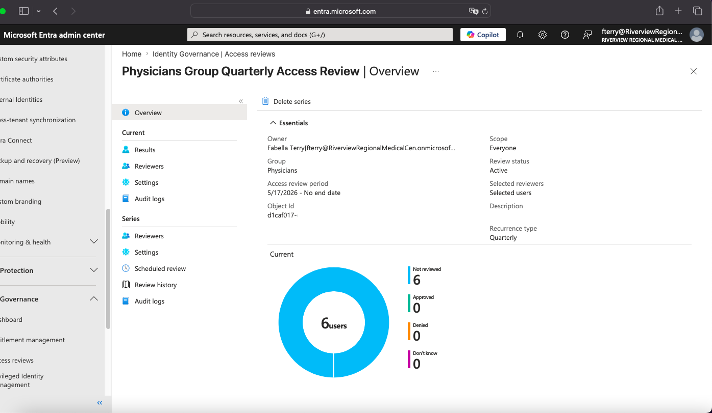

Physicians Group Quarterly Access Review pre-completion state: 6 users pending review, 0 approved, 0 denied. Recurrence type Quarterly. This is the baseline before the business owner acts.

**Step 4 — Dr. James Carter completes the review with written justification**

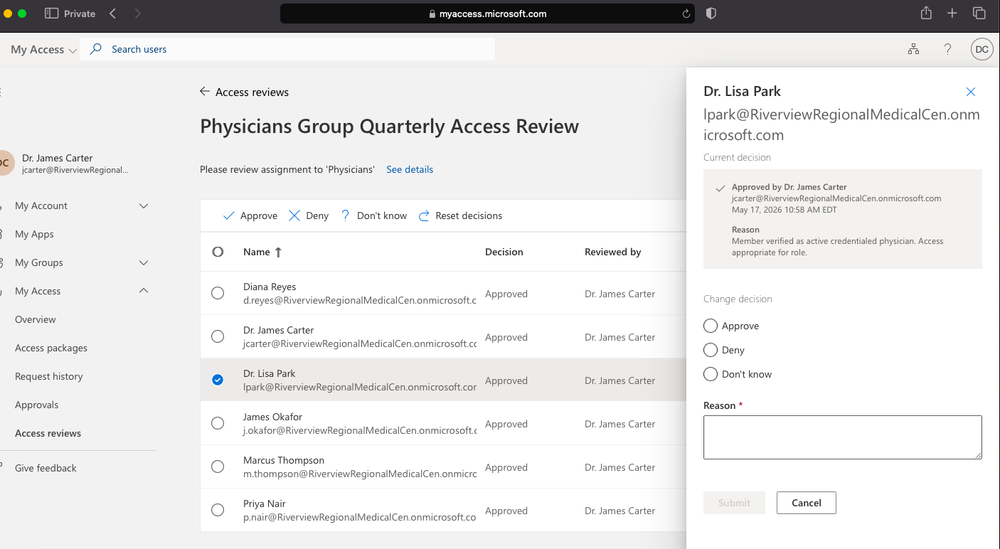

Dr. James Carter reviews and approves each physician from myaccess.microsoft.com using his own credentials. The justification shown: "Member verified as active credentialed physician. Access appropriate for role." Written justification is required — this is not a rubber-stamp review.

**Step 5 — After: 6 approved, 0 not reviewed**

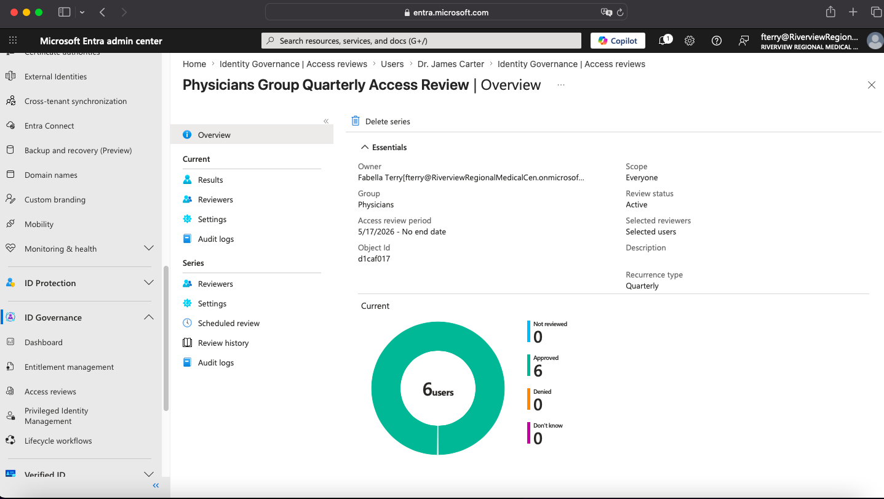

Post-review state: Not reviewed drops to 0, Approved rises to 6. This is the audit-ready outcome — every member of the Physicians group has a documented access decision with a business justification on record.

**NIST Mapping:** AC-2(10) (Shared Accounts), CA-7 (Continuous Monitoring)

---

### Day 5: Contractor Offboarding Automation

Executed a multi-user offboarding workflow for 2 contractors using a CSV-driven PowerShell script. The script handled a real-world edge case: one contractor was already in an offboarded state. Instead of failing, it logged the condition and continued: that error handling is what separates a production script from a lab script.

**What was built:**
- CSV-driven offboarding script with multi-user support
- Offboarding actions: account disable, group removal, app assignment revocation, session revocation
- Graceful error handling for pre-existing offboarded accounts
- JML (Joiners/Movers/Leavers) process documented end-to-end

**Step 1 — Brandon Yates: 6-step offboarding executed**

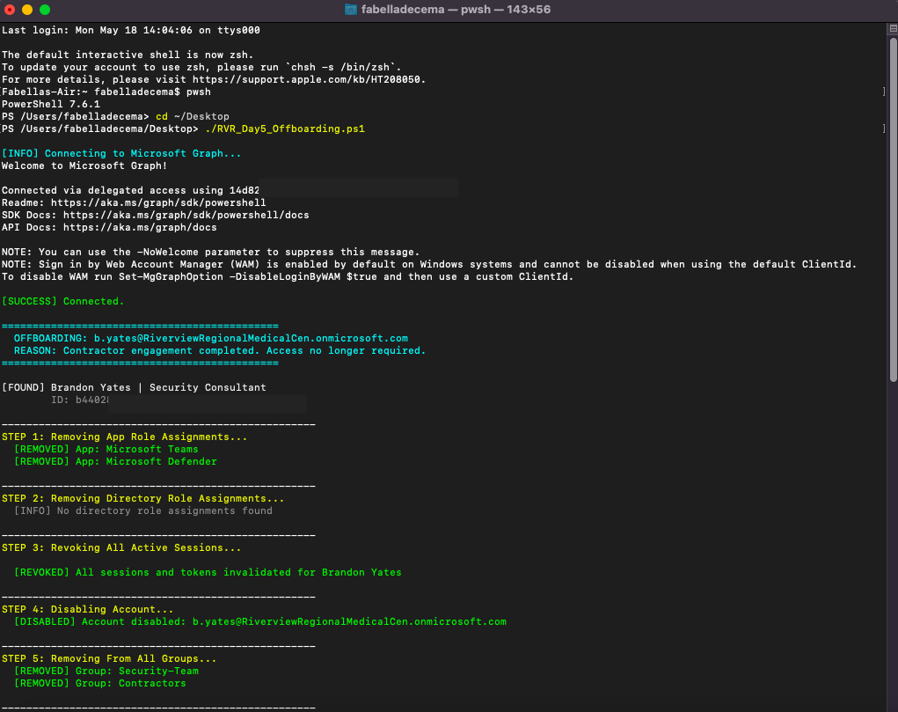

Individual offboarding script for Brandon Yates shows each step sequentially: app assignments removed (Teams, Defender), directory roles checked, all sessions and tokens invalidated, account disabled, removed from Security-Team and Contractors groups. Six discrete steps, all logged.

**Step 2 — Multi-user script: Brandon SKIPPED, Lena OFFBOARDED SUCCESSFULLY**

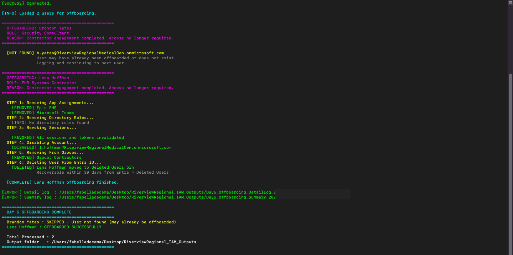

The CSV-driven multi-user script processes both contractors. Brandon Yates returns NOT FOUND — already offboarded — so the script logs it and continues without failing. Lena Hoffman is fully offboarded through all 6 steps including deletion to Deleted Users bin. Final summary: 2 processed, 1 skipped, 1 complete. This is production-grade error handling.

**Step 3 — Contractors group: 0 members confirmed**

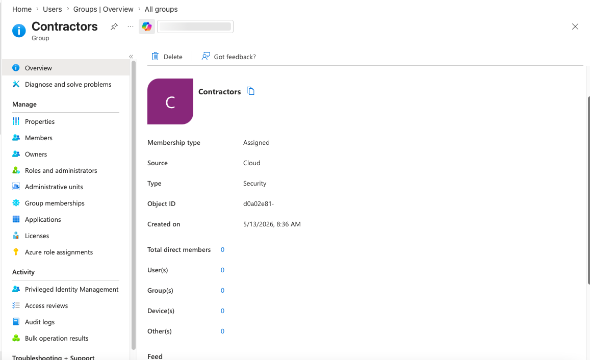

Contractors group overview confirms Total direct members: 0. Both contractors have been removed. The group still exists for future contractor provisioning — the group is not deleted, just emptied.

**Step 4 — Contractors group audit log: Remove member events logged as Success**

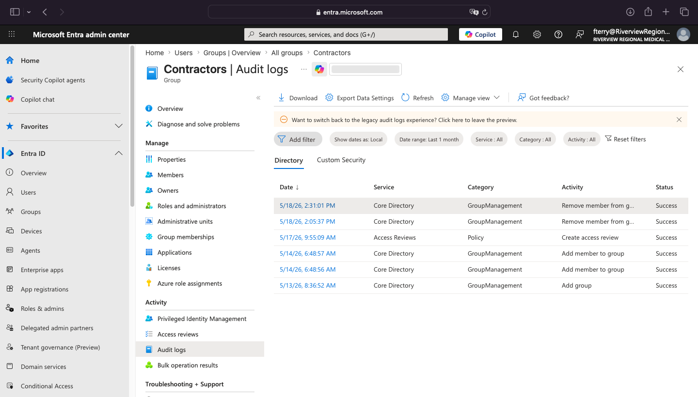

Contractors group audit log confirms two Remove member from group events on 5/18/2026, both showing Success. The full lifecycle is captured: Add member (Day 1), Create access review (Day 4), Remove member (Day 5).

**NIST Mapping:** AC-2(3) (Disable Inactive Accounts), PS-4 (Personnel Termination), IA-4 (Identifier Management)

---

### Day 6: Zero Trust Conditional Access Enforcement

Disabled security defaults and deployed 5 Conditional Access policies to enforce Zero Trust across the tenant. MFA enforcement was confirmed by live testing with a provisioned user account.

**Policies deployed:**

| Policy | Scope | Action |
|---|---|---|
| Require MFA for All Users | All users, all cloud apps | Require MFA |
| Require MFA for Privileged Roles | Global Admin, Security Admin, User Admin | Require MFA |
| Block Legacy Authentication | All users: IMAP, POP3, SMTP, Basic Auth | Block |
| Block High Risk Sign-ins | Risk level: High (Identity Protection) | Block |
| Require MFA for PIM Activation | All PIM eligible role activations | Require MFA |

**Step 1 — Security defaults disabled: reason documented**

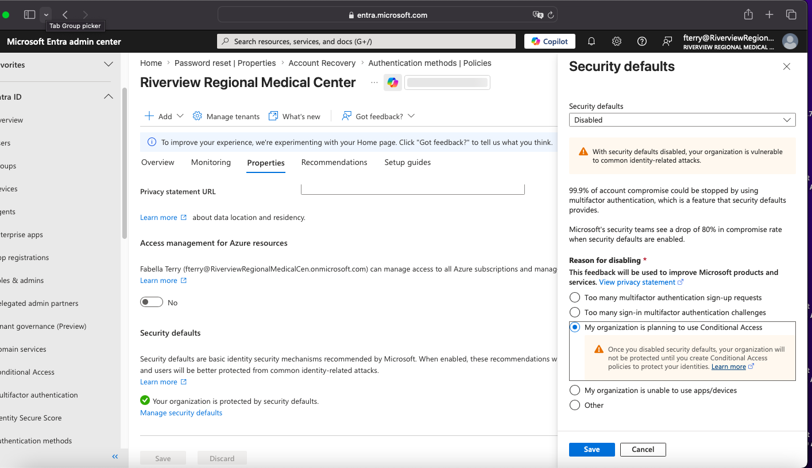

Security defaults set to Disabled with reason "My organization is planning to use Conditional Access." This is a deliberate, documented governance decision — not an accidental change. Disabling without replacement CA policies would leave the tenant exposed.

**Step 2 — All 5 policies deployed via PowerShell: 5 created, 0 failed**

Script output confirms all 5 policies created in Report-only mode first for impact assessment before enforcement. Each policy logged with its state. Zero failures.

**Step 3 — CA Overview: 6 Report-only policies confirmed in portal**

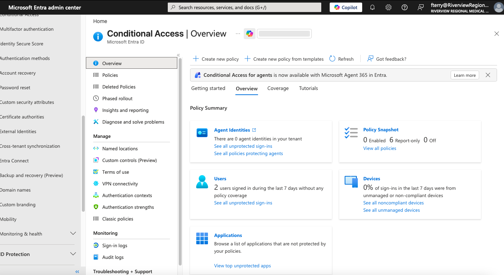

Conditional Access overview shows 0 Enabled, 6 Report-only, 0 Off. All policies are in assessment mode — this is the safe deployment pattern. Report-only captures sign-in impact data before enforcement goes live.

**Step 4 — Admin lockout prevention: Fabella Terry excluded from all policies**

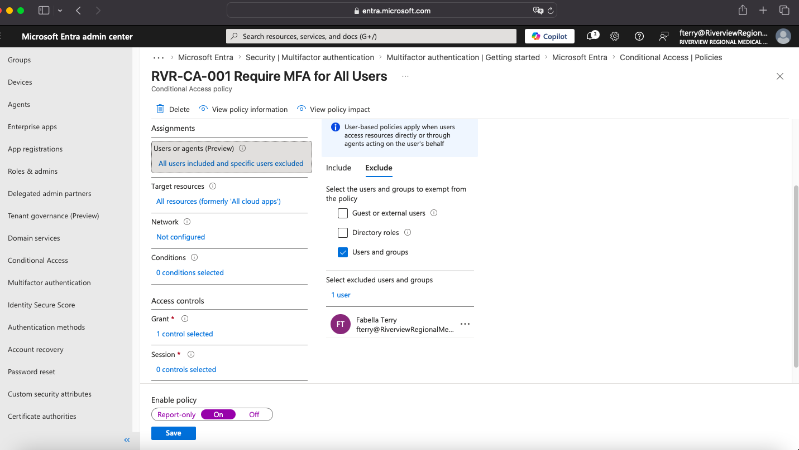

RVR-CA-001 Exclude tab shows Fabella Terry explicitly excluded from the policy. The same exclusion was applied to all 5 policies. This is a standard production safeguard — without a break-glass exclusion, the admin account could be locked out of the tenant permanently.

**Step 5 — MFA enforcement confirmed: Diana Reyes prompted on login**

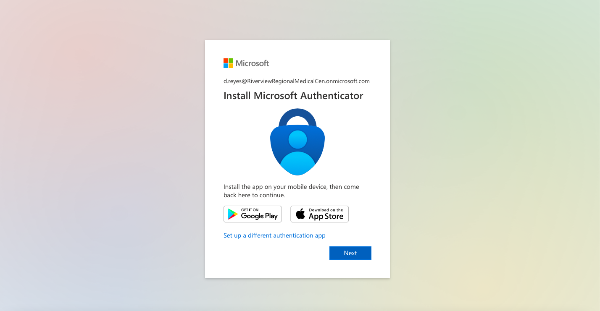

Testing with Diana Reyes's account confirms MFA policy is firing. Microsoft Authenticator install prompt appears on login — exactly the expected behavior when the CA policy triggers for a user with no MFA method registered.

**Step 6 — Audit log: Diana Reyes MFA registration events logged**

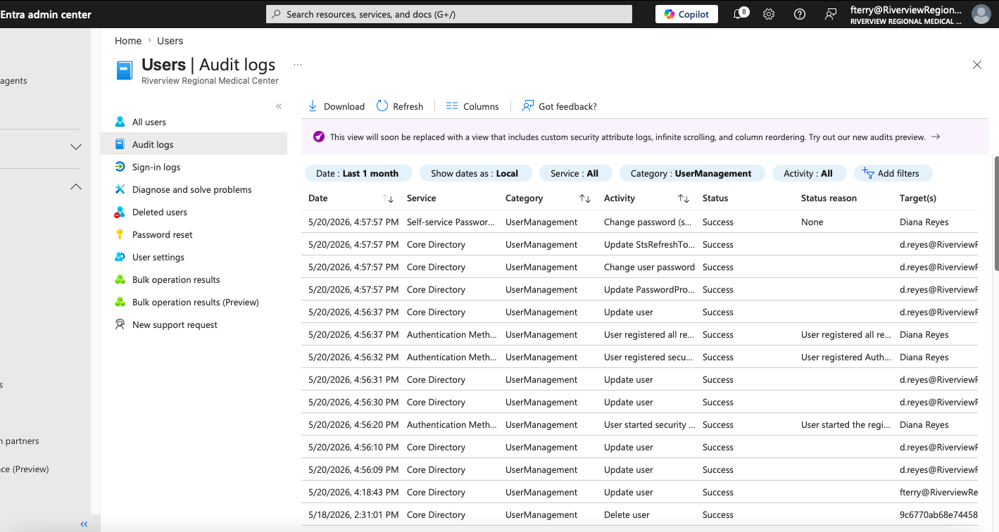

Audit log filtered to Diana Reyes shows MFA registration sequence: User started security registration, User registered authentication method, User registered all required security info. All Success. This is the chain of evidence from policy deployment to user enforcement to audit record.

**NIST Mapping:** AC-17 (Remote Access), IA-5 (Authenticator Management), SI-4 (System Monitoring)

---

## NIST SP 800-53 Control Summary

| Control | Name | Phase |
|---|---|---|
| AC-2 | Account Management | Days 1, 4, 5 |
| AC-2(3) | Disable Inactive Accounts | Day 5 |
| AC-3 | Access Enforcement | Days 1, 3 |
| AC-6 | Least Privilege | Day 2 |
| AC-17 | Remote Access | Day 6 |
| AU-2 | Event Logging | Days 2, 6 |
| CA-7 | Continuous Monitoring | Day 4 |
| CM-7 | Least Functionality | Day 3 |
| IA-4 | Identifier Management | Days 1, 5 |
| IA-5 | Authenticator Management | Days 2, 6 |
| IA-12 | Identity Proofing | Day 1 |
| PS-4 | Personnel Termination | Day 5 |
| SI-4 | System Monitoring | Day 6 |

---

## Key Scripts

| Script | Purpose | Phase |
|---|---|---|
| `provision-users.ps1` | Bulk user provisioning via Graph SDK | Day 1 |
| `configure-pim.ps1` | PIM eligible role assignments | Day 2 |
| `assign-apps.ps1` | Enterprise app role creation and bulk assignment | Day 3 |
| `create-access-reviews.ps1` | Access review creation via Graph API | Day 4 |
| `offboard-contractors.ps1` | CSV-driven multi-user offboarding with error handling | Day 5 |
| `deploy-conditional-access.ps1` | Zero Trust CA policy deployment | Day 6 |

---

## Governance Report

The full governance and security assessment report for this engagement is available in `/docs/RRMC_IAM_Governance_Report.docx`. It includes NIST control mapping, findings, recommendations, and an authentication protocol comparison.

---

## Companion Project

**Day 7: Federation, OAuth 2.0 / OIDC, and Token Governance**  
SAML SSO federation with Salesforce, OAuth 2.0 and OIDC implementation via Microsoft Graph, JWT claims analysis, and PowerShell app registration automation.  
See: [riverview-federation-lab](https://github.com/FabCloudTech/riverview-federation-lab)

---

## Skills Demonstrated

Identity Lifecycle Management | Privileged Access Management | Zero Trust Architecture | PowerShell Automation | Microsoft Graph SDK | Access Reviews | JML Process Design | NIST SP 800-53 | Healthcare IAM Governance | Entra ID Administration

---

*Fabella Terry | IAM Governance Analyst | [fabcloudtech.github.io](https://fabcloudtech.github.io)*
